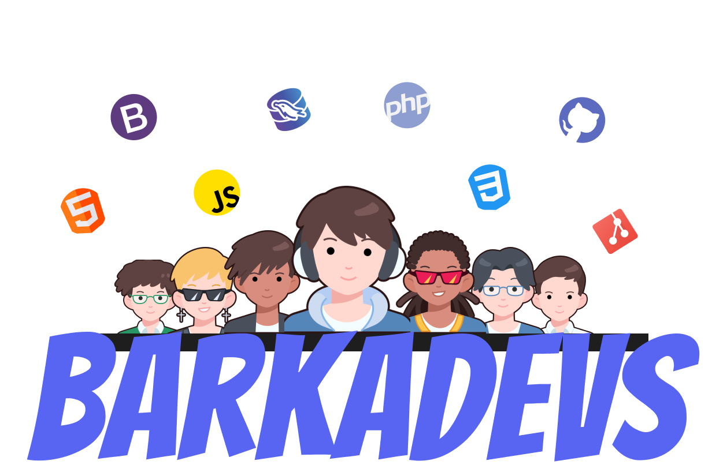

<!-- Replace "barkadevs-logo.jpg" with your actual image file name -->

  

---

## 🌟 About Us

At **BarkaDevs**, we believe in turning ideas into reality. Founded by a team of passionate and driven self-taught developers, we are dedicated to delivering high-quality web and mobile solutions that empower businesses and individuals alike.  

Our commitment to excellence, innovation, and collaboration sets us apart. As we continue to grow, we remain focused on our mission: creating value through technology.

---

## 🛠️ Our Services

- **🌐 Web Development**  
  From dynamic websites to robust web applications, we create solutions that combine performance with aesthetics, ensuring seamless user experiences.  

- **📱 App Development**  
  We design and develop mobile applications that are not just functional but also engaging, catering to Android and iOS platforms.  

We prioritize understanding your needs to build solutions that align with your goals.

---

## 👥 Meet the Team

Our team is the heart of BarkaDevs — a group of talented professionals who bring unique skills and perspectives to every project.

- **Keyan Andy Delgado** - Full Stack Developer, Team Lead  
- **Jener Kevin Ogatis** - Frontend Developer  
- **Lynch Nico Futolan** - Frontend Developer  
- **Zoren Empal** - Project Manager  

Together, we are committed to delivering excellence in every line of code.

---

## 🛠️ Technologies We Use

   
   
  
     
   
   
   
   
   
   
   
   
   
     
     

---

## 🌐 Connect With Us

Let’s build something amazing together!  

- 📧 **[Email Us](mailto:barkadevszxc@gmail.com)**  
